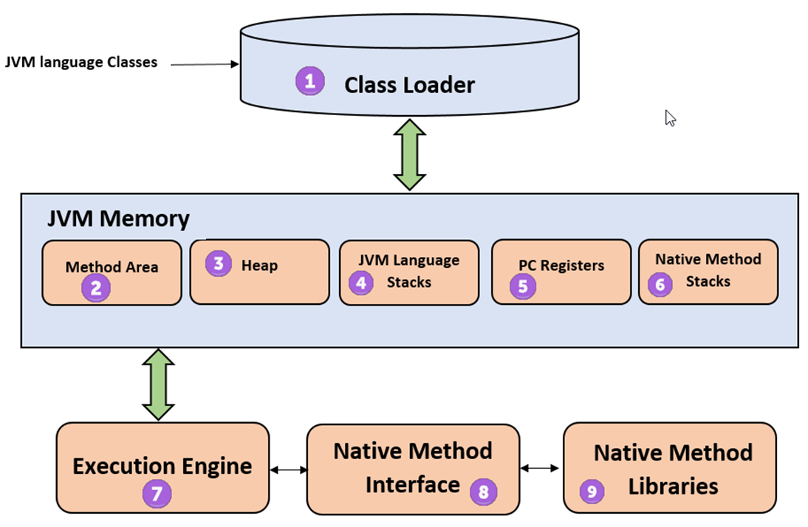

## GarbageCollection


> GarbageCollector : 동적으로 할당한 메모리 영역 중 사용하지 않는 영역을 탐지하여 메모리에서 해제하는 JVM의 작업 

##### GC 장점 
1. 개발자의 실수로 인한 메모리 누수 방지
2. 해제된 메모리를 또 해제하는 이중 해제 예방
3. 해제된 메모리에 접근하는 에러 예방

##### GC 단점
1. GC의 메모리 해제 타이밍을 개발자가 정확히 알기 어렵다.
2. 어떠한 메모리 영역을 해제할지 결정하는데 비용이 든다.
3. GC가 동작하는 동안에는 다른 동작을 멈추기 떄문에 오버헤드가 발생

##### JVM의 메모리 구조

1. Class Loader : 바이트 코드를 읽고 클래스 정보를 메모리의 Heap/Method Area 에 저장
2. JVM Memory : 실행중인 프로그램의 정보가 올라가 있는 메모리
3. Execution Engine : 바이트코드를 네이티브 코드로 변환 시켜주고 GC를 실행

##### JVM 실행 엔진은 GC를 어떻게 실행할까? 

1. 모든 쓰레드가 공유하는 영역인 Method Area 와 Heap
   - Method Area : 프로그램의 클래스 구조를 메타데이터처럼 가지고 있고, 메서드의 코드를 저장해두는 곳
   - Heap : 어플리케이션 실행 중에 생성되는 객체의 인스턴스를 저장하는 영역
2. 각 쓰레드마다 고유하게 생성하며 쓰레드 종료시 소멸되는 Stack (Stack, PC Register, Native Method Stack) 영역이 있음
   - Stack : 메서드 호출을 스택 프레임이라는 블록으로 쌓으며 로컬변수, 중간 연산 결과들이 저장되는 영역
   - PC Register : 쓰레드가 현재 실행할 스택 프레임의 주소를 저장
   - Native Method Stack : C/C++ 과 같은 저차원 코드를 실행하는 영역

* JVM의 GC는 기본적으로 ```Mark And Sweep``` 방식으로 돌아감</br> 
```Mark And Sweep```  : Root 에서부터 해당 객체에 접근이 가능한지가 해제의 기준이 됨.

``` Root Space : Stack이나 Static 공간에 선언된 변수들의 모음 ```


##### GC에서 사용하는 알고리즘

- Reference Counting : Heap 영역의 객체들이 각각의 reference count를 가지고 있고, 이 count 가 0이되면 해당 객체를 해제한다. 순환참조를 해결할 수 없다는 단점이 있다. 
- Mark And Sweep : ```Root Space``` 부터 해당 객체에 접근 가능한지, 아닌지를 메모리 해제의 기준으로 삼는다.
Root Space 부터 그래프 순회를 통해 연결된 객체를 찾아내고(Mark) 연결이 끊어진 객체는 지운다(Sweep).
  - 단점
    1. 의도적으로 GC를 실행해야 한다.
    2. 애플리케이션과 GC 실행이 병행된다. 


#### GC의 실행 방식

- Young Generation 에서 발생하는 Minor GC
- Old Generation 에서 발생하는 Major GC

  - Young Generation
    - Eden :  새롭게 생성된 객체들이 할당되는 영역
    - Survival : Minor GC로부터 살아남은 객체들이 존재하는 영역
      - Survival 0 과 1 중 하나는 꼭 비어있어야 된다. 


eden 영역이 가득차게 되면 minor GC 가 일어남. Root로 부터 접근 가능한 객체라 판단되면 

survival 영역으로 옮겨지는데 객체들의 숫자가 1로 올라감. 해당 숫자는 age-bit 를 뜻함

위와 같은 행위를 반복하다 survival로 넘어온 객체 중 하나가 오래 살아남아서 age-bit가 3이 되는데

JVM GC에서는 일정수준의 age-bit(default : 15) 를 넘어가면 Old Generation으로 넘겨줌 (* 이과정을 Promotion 이라고함)
이러한 방식으로 Old Generation도 다 채워지게 되면 이때 majorGC 가 발생 하면서 ```Mark And Sweep Compact``` 방식을 통해 필요없는 메모리를 비워줌

```Mark And Sweep Compact```

  * Compact는 메모리에서 객체를 제거하고 공간을 재조각 모음하여 메모리 사용을 최적화하는 과정을 의미함</br>
- Serial GC
  - Serial GC는 하나의 스레드로 GC를 실행하는 방식, 스레드가 하나이기 때문에 ```Stop The World``` 시간이 길다. 
  - GC 실행 이후 메모리 파편화를 막는 Compaction 과정을 수행한다.
- Parallel GC
  - Serial GC를 멀티 스레딩으로 수행한다.
- CMS GC
    - 대부분의 GC 를 애프리케이션 스레드와 동시에 수행하여, Stop The World 시간을 최소화한다.
    - 메모리와 CPU 를 많이 사용하고 Compaction 과정이 기본적으로 제공되지 않는 단점이 있다.
  
```Stop The World [STW]: GC를 실행하기 위해 JVM이 어플리케이션 실행을 멈추는 것```
#### G1 GC

  - Garbage First의 약자로, Garbage만 있는 Region을 먼저 회수한다. 
  - JDK9 부터 G1 GC가 기본 GC 방식으로 쓰임

##### G1 GC 장점
  - 별도의 STW 없이 여유 메모리 공간을 압축하는 기능을 제공한다.
  - 전체 Young or Old Generation 통째로 Compaction 할 필요 없고 일부분인 Region에 대해서만 Compaction 하면된다.
  - CMS에 비해 개선된 알고리즘을 사용하고 처리 속도가 빠르다.
  - Heap 크기가 클수록 잘 동작한다.

##### G1 GC 단점
  - 공간이 부족할 경우 Full GC(Heap 전반적으로 GC가 발생) 가 발생하는데 이 GC는 싱글 쓰레드로 동작한다.
  - 작은 Heap 공간을 가지는 어플리케이션에서는 제 성능을 발휘하지 못하고 Full GC가 발생한다.

##### G1 GC의 사이클

  - Young-only Phase : Minor GC만 수행하다가 XX:InitiatingHeapOccupancyPercent(Old Generation 비율)에 지정된 값을 초과하는 순간 Major GC가 수행된다. 그림에서 Old gen occupancy exceeds threshold 부분을 말하는 것이다.
  - Space Reclamation Phase : 위의 구간이 끝나고 공간회수 구간이 시작된다.<br/>
    G1 GC는 위 그림처럼 Young-only Phase와 Space Reclamation Phase를 반복한다. 사이클 중 모든 원은 STW가 발생한 것을 나타낸 것이고, 원의 크기에 따라 STW 소요 시간이 달라진다.<br/>
    파란 원은 Minor GC(= Young GC, Evacuation Pause)가 진행함에 따라 STW가 발생한 것이고, <br/>
    주황 원은 Major GC(= Old GC, Concurrent Cycle)이 진행하면서 객체를 마킹 및 기타 과정을 하기 위해 STW가 발생한 것이고, <br/>
    분홍색 원은 Mixed GC를 진행함에 따라 STW가 발생한 것이다. 
##### G1 GC의 동작 과정

1. Initial Mark : Young 영역에서 객체 생성 및 수명 주기를 추적하며, Old 영역에서는 큰 객체 및 오래된 객체를 추적합니다. G1 GC는 이러한 영역들의 레퍼런스 정보를 초기 마크라는 단계에서 모두 수집한다.
2. Root Region Scan : 루트로부터 시작하여 전체 객체 그래프를 탐색 하여 Young 영역과 Old 영역으로 분류한다.
3. Concurrent Mark : 전체 힙의 Region에 대해 스캔 작업을 진행하며, GC 대상 객체가 발견되지 않은 Region 은 이후 단계를 처리하는데 제외되도록 한다.
4. Remark : 애플리케이션을 멈추고(STW) 최종적으로 GC 대상에서 제외될 객체(살아남을 객체)를 식별해낸다.
5. Cleanup : 애플리케이션을 멈추고(STW) 살아있는 객체가 가장 적은 Region 에 대한 미사용 객체 제거 수행한다. 이후 STW를 끝내고, 앞선 GC 과정에서 완전히 비워진 Region 을 리스트에 추가하여 재사용될 수 있게 한다.
6. Copy : GC 대상 Region이었지만 Cleanup 과정에서 완전히 비워지지 않은 Region의 살아남은 객체들을 새로운(Available/Unused) Region 에 복사하여 Compaction 작업을 수행한다.

 

##### JAVA 8 이전

* Static Object 들은 Heap 영역에서 Permanent Generation 영역에 저장이 되어 GC의 대상이 되지않았다. 

##### JAVA 8 이후

* Permanent 영역이 사라지고 MetaSpace가 생겼다. 
> 왜 MetaSpace가 생겨났을까 ? 
>  Permanent 영역의 한계 때문! Permanent 영역이 클래스 로딩과 어노테이션 처리 등에 사용되었으나, Permanent 영역의 크기는 고정되어있어 OutOfMemory 에러가 잦았다.

* MetaSpace 
 - 기존의 Permanent 영역과는 달리 힙 영역이 아닌 네이티브 메모리를 사용하여 클래스 메타데이터를 저장합니다. 이로 인해 클래스 로딩에 필요한 메모리를 동적으로 할당할 수 있게 되어, 메모리 부족 문제를 해결할 수 있다.
 - Permanent 영역에서 발생하던 메모리 누수 문제를 방지하기 위해 자동으로 메모리를 해제하며, Permanent 영역에서 발생하던 클래스 로딩 속도 저하문제도 개선 되었다. 

> java 8 부터 Static Object는 Heap 영역에 저장되는데 static은 GC의 대상일까?
</br>
 
> Answer : YES !</br> 
Java 8 이후의 Metaspace GC는 기본적으로 GC가 필요한 경우 자동으로 동작한다. 이때, Metaspace GC는 클래스 로딩 및 언로딩에 따라 발생한다. 
즉, Static Object가 참조하는 클래스가 언로딩되는 경우에 해당 객체가 GC의 대상이 되지만, 클래스 로딩이 한 번 발생하면, 해당 클래스와 관련된 Metaspace 영역은 JVM이 종료될 때까지 계속 유지된다.</br>
이러한 이유로, Java에서는 Static Object를 가능한한 적게 사용하도록 권장


  