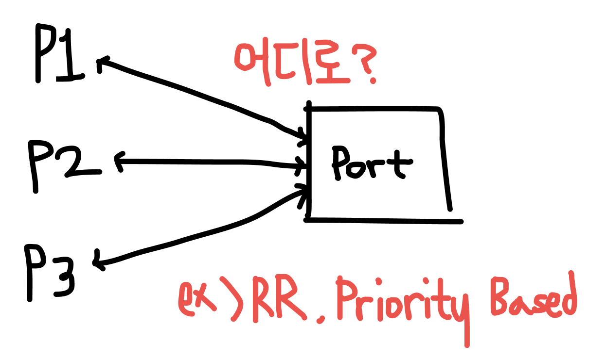

# 프로세스 간 통신 (IPC)

---

## IPC (Inter Process Communication)

프로세스는 데이터 공유 여부에 따라 독립적 프로세스와 협력적 프로세스로 나뉩니다. 

독립적 프로세스는 데이터를 공유하지 않는 프로세스로, 다른 프로세스에게 영향을 받지 않습니다.

반면, 협력적 프로세스는 서로 데이터를 공유하기 때문에 다른 프로세스로부터 영향을 받습니다.

여기서 IPC는 협력적 프로세스 간에 통신하는 방법을 의미합니다.

IPC의 종류에는 공유 메모리 방식과 메시지 전달 시스템이 있습니다.

## 공유 메모리

공유 메모리 방식은 이름에서 알 수 있듯이, 협력 프로세스 간 공유하는 메모리 단을 구축하여 데이터를 공유하는 방식을 의미합니다.

처음 공유 메모리를 구축할 때만 시스템(커널)의 개입이 필요하고, 그 이후에 데이터를 교환하는 과정에서 별도의 시스템의 개입이 필요하지 않습니다. 또한, 공유 메모리의 형식과 위치는 운영체제의 간섭 없이 두 협력 프로세스에서 결정됩니다.

기본적으로 프로세스의 내부 공간에는 다른 프로세스가 접근하지 못합니다. 두 프로세스 간 공유 메모리를 설계한다는 것은 이 접근하지 못한다는 제약 조건을 제거하는 것과 같은 의미입니다.

### 버퍼

버퍼는 생산자-소비자 문제를 해결하는 방법 중 하나입니다. 공유 메모리 내부에 존재해 공유 메모리의 데이터를 관리합니다.

- 구현

버퍼는 다음 빈 위치 값을 나타내는 `in`과 첫 번째로 채워진 위치를 나타내는 `out` 2개의 포인터로 구성된 원형 배열로 구현됩니다.


- 종류

버퍼의 종류에는 크게 **무한 버퍼(unbounded buffer)**와 **유한 버퍼(bounded buffer)**로 나뉩니다.

무한 버퍼는 크기의 한계가 없는 버퍼이며, 유한 버퍼는 크기가 고정되어 있는 버퍼입니다.

유한 버퍼 사용 시, 버퍼가 비어있다면 소비자 프로세스에서 자동 대기하게 되고 버퍼가 꽉 차 있을 때는 생산자 프로세스에서 대기하게 됩니다.

## 메시지 전달 시스템

메시지 전달 시스템 방식은 주소 공간을 공유하지 않고 통신하는 방법입니다.

메시지 전달 시스템은 운영체제나 프로세스 내부에 위치한 메일 박스(포트라고도 불림)에 메시지를 전달하여 데이터를 교환하는 방법입니다.

충돌 회피 기법이 따로 필요 없어, 적은 양의 데이터를 교환하는 데에 적합합니다.

하지만 메일박스의 데이터를 관리하는 과정에서 지속적인 운영체제의 간섭이 필요합니다.

### 메시지의 종류

메시지의 종류에는 **고정 길이 메시지**와 **가변 길이 메시지**가 있습니다.

- **고정 길이 메시지**

고정 길이 메시지는 메시지의 길이 파악이 필요없으므로 시스템의 구현이 직선적이고 단순합니다. 그로 인해 응답 시간을 예측할 수 있고 가변 길이 메시지보다 더 빠른 성능을 보여줍니다.

하지만 가변적이지 않기 때문에 불필요한 자원 소모가 있을 수 있고 응용 프로그램 개발시 관련 사항을 처리하기 어렵습니다.

- **가변 길이 메시지**

반면에 가변 길이 메시지는 메시지의 길이를 파악하는 과정이 필요하므로 시스템의 구현이 복잡하고 처리 시간이 오래 걸릴 수 있습니다.

그렇지만 가변적이기 때문에 불필요한 자원 소모를 방지할 수 있으며, 시스템 단에서 관련 처리를 다 구현하기 때문에 응용 프로그램을 개발할 때 비교적 간편하다는 장점이 있습니다.

### 통신 연결

메시지를 전달하기 전에 각 프로세스 간의 연결이 필요합니다.

통신 연결은 연결 방법에 따라 다음과 같은 종류로 나뉩니다.

- **직접/간접 통신**
- **동기/비동기식 통신**
- **자동/명시적 버퍼링**

### 직접 통신

직접 통신은 프로세스의 이름을 명시하여 메시지를 전달하는 방식을 의미합니다.

프로세스의 이름을 직접적으로 명시하기 때문에 연결이 자동으로 구축되며, 각 프로세스는 서로의 identity 값만 알면 연결이 가능합니다.

연결 시, 두 프로세스 간 단 하나의 통신 경로만 설정됩니다.


직접 통신은 명시 방법에 따라 **대칭적 방식**과 **비대칭적 방식**으로 나뉩니다.

- **대칭적 방식**: 송수신 모두 이름을 명시하는 방식

```
send(P, message) - 프로세스 P에 메세지 송신
receive(Q, message) - 프로세스 Q로부터 메세지 수신
```

- **비대칭적 방식**: 송신자만 이름을 명시하는 방식

```
send(P, message) - 프로세스 P에 메세지 송신
receive(id, message) - 메세지 수신 (id=PID)
```

### 간접 통신

간접 통신은 메일 박스(포트)를 통해 메시지를 전달하는 방식을 의미합니다.

프로세스가 새로 메일박스를 가질 때 연결이 구축됩니다.

각각의 프로세스 사이에 여러 연결이 있을 수도 있으며, 각 연결은 하나의 메일 박스에 대응됩니다.

하나의 메일 박스에 여러 프로세스가 연결되어 있으므로, 그 중 어떤 프로세스에게 메시지를 수신할 지 결정하는 알고리즘(라운드 로빈 등)이 필요합니다. 



```
send(A, message) - 메일박스 A로 메세지 송신
receive(A, message) - 메일박스 A로 메세지 수신
```

### 메일 박스 (포트)

메일 박스는 포트라고도 불리며, 메세지가 저장되고 제거되는 객체를 의미합니다.

메일 박스는 프로세스와 마찬가지로 각각의 고유 id 값을 가집니다.

또한, 메일 박스는 프로세스나 운영체제의 소유되는데, 소유자에 따라 관리 방법이 달라집니다.

- **프로세스 소유 메일 박스**

프로세스 소유의 메일 박스는 프로세스 내부에 위치하여 메시지를 관리하게 됩니다.

이때, 메일 박스를 가진 프로세스를 소유자, 그 이외 해당 메일 박스와 연결되어 있는 프로세스를 소비자로 구분하게 됩니다.

이름에서 유추할 수 있듯이, 소유자 프로세스는 데이터의 수신만 가능하며, 소비자 프로세스는 소유자로 데이터를 송신만 가능합니다.

송수신 프로세스가 명확하게 구분되어 있기 때문에 데이터의 혼선이 없어 관련 처리가 쉽다는 장점이 있습니다.

하지만 메일 박스를 소유하는 프로세스가 종료될 때, 메일 박스도 같이 삭제되기 때문에, 해당 메일 박스에 연결 중인 프로세스들에게 해당 메일 박스가 삭제되었다는 별도의 통보가 필요합니다.

- **운영체제 소유 메일 박스**

운영체제가 소유하는 메일 박스는 어떠한 프로세스에도 속하지 않고 독립적인 형태를 띕니다.

운영체제가 메일 박스를 소유하기 때문에 프로세스가 직접적으로 메일 박스를 관리하거나 생성할 수 없습니다.

그래서 운영체제는 프로세스가 메일 박스를 관리할 수 있도록, 메일 박스를 생성, 삭제하거나 메일 박스에 메시지를 송수신하는 메일 박스 관리 기법들을 제공해야 합니다.

### 동기화

메시지 전달 방식에 따라 동기식 통신과 비동기식 통신으로 나뉘게 됩니다.

- **동기식 통신 (봉쇄형 통신, blocking)**
- **비동기식 통신 (비봉쇄형 통신, unblocking)**

### 버퍼링

또 버퍼의 길이에 따라 시스템의 종류가 나뉩니다.

크게 버퍼가 없는 메시지 시스템(무용량)과 자동 버퍼링 시스템(유한/무한 용량)으로 분류됩니다.

- **무용량**

무용량은 최대 길이가 0인 큐를 의미합니다. 최대 길이가 0이기 때문에 메시지를 가질 수 없습니다.

- **유한 용량**

유한 용량은 최대 길이가 유한한 값인 n을 가진 큐를 의미합니다. 큐가 가득 찼을 때만 blocking 됩니다.

- **무한 용량**

무한 용량은 무한한 길이의 큐를 의미합니다. 용량의 제한이 없기 때문에 송신자 프로세스가 blocking되는 경우 없이 계속해서 메시지를 보낼 수 있습니다.

## 사례

### Windows의 ALPC

Windows에서는 고급 로컬 프로시저 호출 설비(ALPC)를 이용해 메시지를 전달합니다.

두 프로세스 간 연결을 구축하고 유지하기 위해 포트 객체를 사용하는데, 연결 요청 시에 사용되는 연결 포트와 직접적인 데이터 통신할 때 사용되는 통신 포트로 구분됩니다.

- ALPC의 호출 과정
1. 서버 프로세스가 다른 프로세스들에게 연결 포트 객체를 알립니다.
2. 클라이언트 프로세스가 연결이 가능한 경우, 포트 객체에 대한 핸들을 열고 연결 요청을 보냅니다.
3. 서버 프로세스는 채널을 생성하고 핸들을 클라이언트 프로세스에게 반환하면서 연결을 허락합니다.

- 메시지 전달 기법의 종류
1. 256바이트 이하의 작은 메시지
    
    포트의 메시지 큐가 중간 저장소로 사용되어, 데이터를 전달할 프로세스에 데이터 자체를 복사하여 전달합니다.
    
2. 대용량 메시지
    
    대용량 메시지는 섹션 객체(section object)를 통해서 전달됩니다.
    
    섹션 객체는 채널과 연관된 공유 메모리 영역입니다. 중간 저장소로 메시지 큐를 사용하는 대신 공유 메모리 섹션을 할당하여 더 큰 데이터를 전달합니다.
    
    전달하려는 메시지가 대용량 메시지라고 판단되면, 서버 프로세스는 자동으로 섹션 객체를 생성하고, 클라이언트 프로세스에게는 해당 섹션 객체를 가리키는 포인터와 크기에 관한 정보를 담은 작은 메시지를 보냅니다.
    
3. 더 많을 경우
    
    데이터 양이 너무 많아 섹션 객체에 저장할 수 없을 때는 서버 프로세스가 직접 클라이언트 프로세스를 읽고 쓸수 있도록 하는 API를 사용해 데이터를 전달하게 됩니다.
    

>💡 참고로 Windows API는 응용 프로그래머가 사용하지 못합니다.

---

- 운영체제
- [KOCW 운영체제 6: 생산자 소비자 문제(Producer-Consumer Problem)](https://m.blog.naver.com/qriositylog/221785171412)