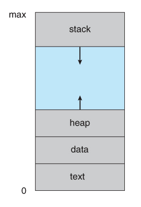
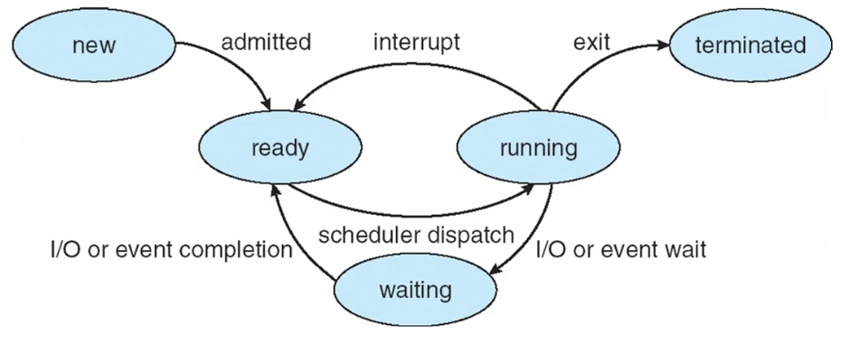

# 프로세스

---

## 프로세스란?

> 💡 **프로그램**
> 디스크에 저장된 명령어 집합(실행파일), 수동적인 존재

CPU에 자원을 할당받아 로드되어 실행 중인 프로그램을 의미합니다. 운영체제의 작업의 단위로 사용됩니다.

운영체제가 해야하는 가장 기본적인 일이 바로 이 프로세스의 관리입니다.

## 프로세스의 메모리 영역

프로세스의 메모리 영역은 여러 개의 단계로 나뉩니다.

- 텍스트 섹션: 실행 코드, 명령어들
- 데이터 섹션: 전역 변수
    - 초기화된 영역
    - 초기화되지 않은 영역 (BSS, Block Stated Symbol)
- 힙 섹션: 프로그램 실행 중 동적으로 할당되는 메모리
- 스택 섹션: 함수 호출 시 쌓이는 임시 데이터(함수 매개변수, 복귀 주소값, 로컬 변수 등)

텍스트 및 데이터 섹션의 크기는 고정되기 때문에 실행 시간동안 크기가 변하지 않습니다. 하지만, 스택과 힙 섹션의 경우 실행 중에 동적으로 크기가 변환될 수 있습니다. 스택과 힙 섹션은 서로의 방향으로 커지기 때문에, 메모리가 부족하다면 CPU로부터 추가적으로 메모리를 할당받게 됩니다.

## 프로세스의 생명 주기

프로세스는 실행하면서 상태가 변하게 

### **간단하게 살펴보기**

`fork()` 명령어를 통해 프로세스를 새로 생성하게 되면, 프로세스는 New 상태가 됩니다.

그리고 해당 프로세스는 `Ready Queue`에 등록되어 대기하다가 CPU의 허락이 떨어지면, Running 상태로 변경됩니다. 여기서, Ready 상태에서 Running 상태로 되는 것을 디스패치라고 합니다.

만약 프로세스가 너무 오랜 시간 실행 중이라면(CPU를 점유 중이라면) 시간초과로 인해 인터럽트되어 Ready 상태가 됩니다.

또는, 프로세스를 실행 중 입출력 신호나 특정 이벤트를 받게된다면 해당 프로세스는 Waiting 상태가 되고 이벤트 처리가 모두 끝나면(Completion 신호가 왔을 때) Ready 상태로 돌아가게 됩니다.

이 과정을 반복하다 코드 블럭을 다 실행하였다면 프로그램이 Terminated되어 자원과 메모리가 해제됩니다.

## PCB (Process Control Block) or TCB (Task Control Block)

PCB는 프로세스 제어 블럭으로, 프로세스와 연관된 여러 정보를 하나의 구조체로 정의한 것을 의미합니다. 운영체제는 이 PCB를 통해 프로세스를 관리합니다.

PCB는 프로세스 생성 시에 만들어지며, 실행 중일 때는 CPU 메모리에 저장되고 다른 프로세스가 실행 중일 때는 보조 기억장치에 저장이 됩니다.

PCB에는 다음과 같은 정보를 보관합니다.

- PID(Process IDentification Number): 프로세스 고유 식별 번호
- 프로세스 상태
- 프로그램 카운터 (PC): 다음에 실행할 명령어의 번지 수를 저장하는 레지스터
- CPU 스케줄링 종류
- 메모리 관리 정보: 페이지/세그먼트 테이블 등
- 회계(Account) 정보: 자원의 사용 시간 등
- 입출력 상태 정보: 입출력 장치와 파일의 열람 기록

>💡 **스와핑 (Swapping)**  
> CPU에 적재한 프로세스와 보조기억장치에 적재한 다른 프로세스의 메모리를 교체하는 기법

## Context Switching

**Context**란 프로세스가 사용되고 있는 상태로, PCB 정보를 의미합니다. Context에는 CPU 레지스터의 값, 프로세스의 상태, 메모리 관리 정보 등을 포함합니다.

Context Switching은 멀티 프로세싱 환경에서 다른 프로세스를 실행하기 위한 개념입니다. 

다음 우선 순위의 프로세스를 실행하고자 할 때, 인터럽트를 발생시켜 현재 프로세스의 Context를 저장하여 새 프로세스의 Context와 교체하는 방법을 의미합니다.

인터럽트 요청에 따른 작업이 다 처리되면 저장된 Context를 다시 복구하여 이어서 작업을 재개하게 됩니다.

Context Switching은 시간이 오래 걸리는 작업이기 때문에 빈도가 많을 시, 오버헤드를 발생시켜 성능을 저하할 수 있습니다.

### 인터럽트 요청 종류

- I/O request (입출력 요청)
- time slice expired (CPU 사용 시간이 만료되었을 때, 시간초과)
- fork a child (자식 프로세스 생성)
- wait for an interrupt (인터럽트 처리를 기다릴 때)

등…

### Context Switching이 필요한 이유

- **멀티 태스킹**: CPU가 매우 빠르게 프로세스를 전환하여, 사용자로 하여금 여러 작업이 동시에 실행되는 것처럼 보이게 하기 위함입니다. 사용자가 하나의 프로세스가 끝날 때 동안 기다릴 필요 없이 동시에 수행할 수 있기에 사용자 경험이 향상됩니다.
- **CPU 자원의 활용**: 프로세스가 실행될 준비를 위해 대기하는 구간동안 다른 프로세스를 실행함으로써, CPU와 자원을 최대한으로 활용할 수 있습니다.

## 프로세스의 종료

실행하고 있는 프로세스의 마지막 구문이 끝나면 자동으로 종료됩니다. 강제적으로는 UNIX의 `exit()` 시스템 함수를 통해 종료할 수 있습니다.

프로세스가 종료되면 해당 프로세스와 관련된 모든 자원들이 해제되는 작업을 거치게 됩니다.

`wait()` 시스템 함수를 호출하면 부모 프로세스는 자식 프로세스가 종료될 때까지 기다릴 수 있습니다.

### 고아 프로세스

고아 프로세스는 부모 프로세스가 자식 프로세스보다 먼저 종료된 자식 프로세스를 의미합니다.

부모 프로세스가 먼저 종료하게 되면, 자식 프로세스는 init 프로세스를 새로운 부모 프로세스로 삼게 됩니다.

>💡 **Init 프로세스**  
>컴퓨터 부팅 중 최초로 생성되는 프로세스로, 시스템이 종료될 때까지 계속 실행하는 데몬 프로세스
>PID는 1로 할당되며, 모든 프로세스는 Init 프로세스를 부모 프로세스로 가짐

고아 프로세스가 종료되면, init 프로세스가 wait() 함수를 자동으로 호출해주어 고아 프로세스의 종료 상태를 회수하여(메모리, 자원 해제 등) 좀비 프로세스가 되는 것을 방지합니다.

### 좀비 프로세스

반면에, 좀비 프로세스는 자식 프로세스가 종료되었지만, 부모 프로세스가 자식 프로세스의 종료를 회수하지 않았을 때의(wait()을 호출하지 않았을 때의) 자식 프로세스를 의미합니다.

---

- Operating System Concepts
- [좀비 프로세스와 고아 프로세스(Zombie process and Orphan process)](https://codetravel.tistory.com/31)
- [OS - Context Switch(컨텍스트 스위치)가 무엇인가?](https://jeong-pro.tistory.com/93)
- [Process Management](https://gusdnd852.tistory.com/82)